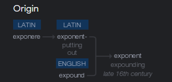
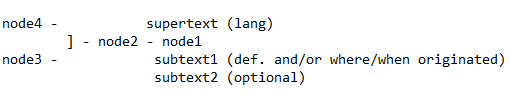

# etymolograph
 
 
regular parsing:

node1 (all text before ':') - node1{query};subtext2?{word inside single quotes, inside parenthases, before ':'};subtext1{text before parenthases or text before ':'}
  node2+ (all text between ':' and '.') - node
    

i really dont know if i can do this
